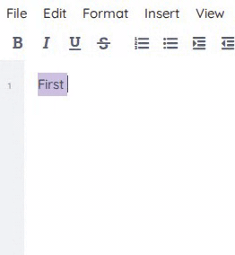

 [](https://github.com/ether/ep_copy_paste_select_all/actions/workflows/test-and-release.yml)

# Select all, Copy, Paste and Find / Replace

For use with File Menu Toolbar plugin (I think)...

## Installation

Install from the Etherpad admin UI (**Admin → Manage Plugins**,
search for `ep_copy_paste_select_all` and click *Install*), or from the Etherpad
root directory:

```sh
pnpm run plugins install ep_copy_paste_select_all
```

> ⚠️ Don't run `npm i` / `npm install` yourself from the Etherpad
> source tree — Etherpad tracks installed plugins through its own
> plugin-manager, and hand-editing `package.json` can leave the
> server unable to start.

After installing, restart Etherpad.
